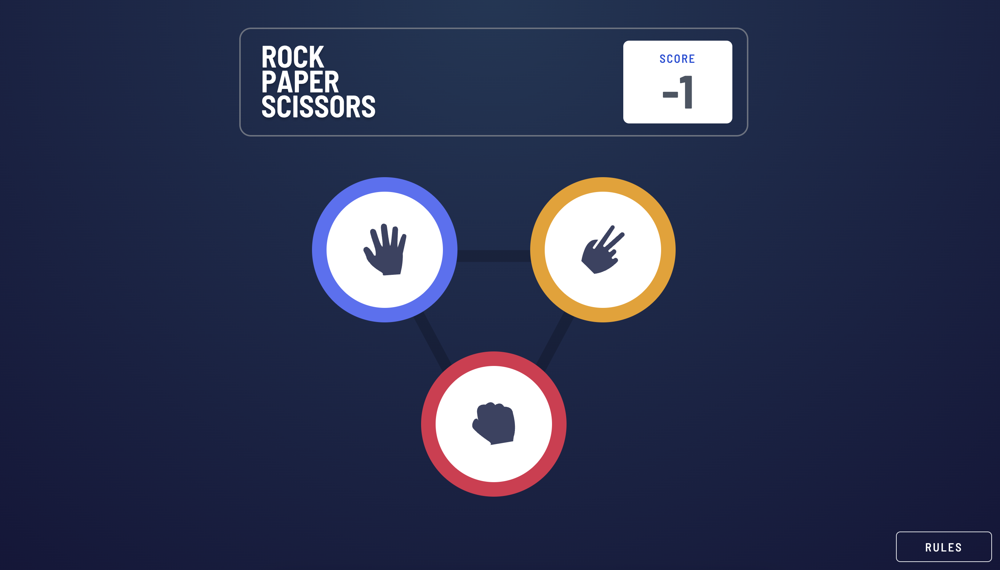

# Rock Scissors Paper game! 

This is a game well known game called Rock, Paper, Scissors!

Rules are very easy: 
- Paper beats Rock
- Rock beats Scissors
- Scissors beats Paper

If the player wins, they gain 1 point. If the computer wins, the player loses one point.

## Live Site

Check out the live site [here](https://interactive-comments-rho.vercel.app/).

## Screenshots

Here are the main page and the visual explanation for the components.
### Main Page

### Mobile Version

## Features

- You can view the optimal layout for the game depending on their device's screen size. There are two screen sizes available (desktop: 1360px and mobile:375px wide)
- User can play Rock, Paper, Scissors against the computer
- **Bonus1**: User can maintain the state of the score after refreshing the browser (local storage has been used)

Users also have a chance to to:
- [x] see hover states for selectable rock, paper or scissors
- [x] see loading message while latest score is loading from the state

## Tech Stack

The project is built using the following technologies:

- React: A JavaScript library for building user interfaces.
- Nextjs: A javascript framework works top on the React and uses all the benefits of React. It helps for SSG, SSR and routing.
- Tailwind CSS: A utility-first CSS framework that enables rapid UI development with pre-defined styles and components. Flexbox and Grid structure has been used for creating the layout.
- Typescript: Type safe version of Javascript.

## Installation and Usage

- Clone the repository: `git clone https://github.com/mehmetakifakkus/interactive-comments.git`
- Navigate to the project directory: `cd rest-api-countries`
- Run `npm install` to install project dependencies.
- Run `npm run dev` to start the development server.
- Open your browser and visit `http://localhost:3000` (or the specified port) to view the application.

## Folder Structure

- `app`: Contains the source code of the Nextjs application. It uses Nextjs app router.
  - `page.tsx`: Entry point of the application that runs when routing is `/`.
  - `components`: Contains reusable React components used throughout the application.
  - `context`: It contains context used in the application. There are two context: 1) User context: stores main user that interacts with the comments section 2) Comments context which makes comments and their replies available throughout the application
  - `globals.css`: Contains Tailwind directives and custom styles for the application.
  - `screenshots`: Includes screenshots of the application.
  - `guide`: Includes frontendmentor.com guide files, also accessible [from](https://www.frontendmentor.io/challenges/rock-paper-scissors-game-pTgwgvgH/hub)

## Deployment

To deploy the application to production, run `npm run build`. This will create an optimized build in the dist folder, which can be deployed to a web server or hosting service of your choice.

## Contributing

Contributions to the project are welcome! Feel free to open issues and pull requests for bug fixes, improvements, or new features.

## Author

- Website - [mehmetakifakkus](https://mehmetakifakkus.github.io)
- Frontend Mentor - [@mehmetakifakkus](https://www.frontendmentor.io/profile/mehmetakifakkus)
## License

This project is licensed under the [MIT License](LICENSE). This is a solution to the [Interactive comments section challenge on Frontend Mentor](https://www.frontendmentor.io/challenges/rock-paper-scissors-game-pTgwgvgH/hub). Frontend Mentor challenges help you improve your coding skills by building realistic projects. 